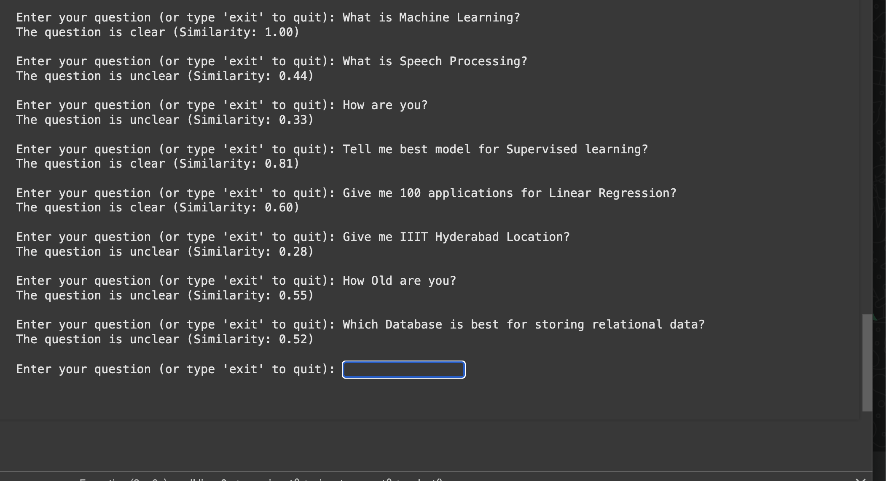
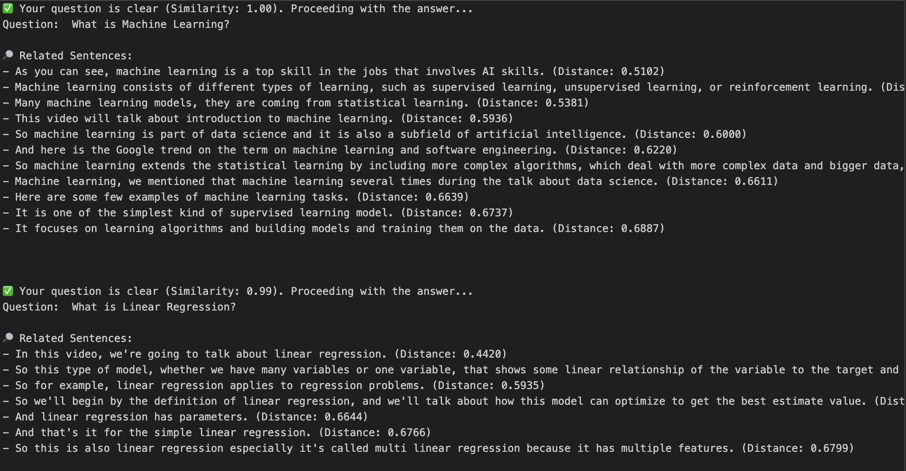

# BTP 1 - Automatic multimodal question and answering for video lectures

**Presentation:** [Canva Link](https://www.canva.com/design/DAGhsnSEdRo/IxsYfXwTJMAf6B7icCmBbQ/view?utm_content=DAGhsnSEdRo&utm_campaign=designshare&utm_medium=link2&utm_source=uniquelinks&utlId=hb2715aa87e)

> Dataset Link: [Coursera Website](https://www.coursera.org/learn/introduction-to-machine-learning-supervised-learning/home/week/1)

## Question Classifier Output


## Finding Related Sentences for Question Output


## Project description
This work involves synthesizing a video from a set of video lectures that answers the question raised by the student. This contains following objectives.
1. Select a video lectures set that containing SRTs.
2. Study and implement the voice activity detection (VAD) algorithm.
3. Extract the speech segments from the VAD output.
4. Identify the spoken content in text form using ASR for each segment.
5. Obtain the sentence specific time stamps.
6. Create answer summary.
7. Identify video parts corresponding to the answer summary.
8. Stitch the summary video segments to obtain natural like video.

## Guide
Chiranjeevi Yarra (Spoken Language Forensics & Informatics (SLFI) group - LTRC)

## 🎵 Video to Audio Conversion

This script extracts audio from multiple `.mp4` video files and saves them as `.wav` files with specified audio parameters.

---

## ✅ Prerequisites

Make sure you have `ffmpeg-python` installed. You can install it using:

```bash
pip install ffmpeg-python
```

---

## 📂 Input and Output

### 📥 Input
- Folder: `Data/Videos`
- File Type: `.mp4` video files
- Example:
  ```
  Data/
  ├── video1.mp4
  ├── lecture2.mp4
  └── sample3.mp4
  ```

### 📤 Output
- Folder: `Data/Audios` (automatically created if it doesn't exist)
- File Type: `.wav` audio files
- Example:
  ```
  audios/
  ├── video1.wav
  ├── lecture2.wav
  └── sample3.wav
  ```

Each output file corresponds to an input `.mp4` file with the same base filename.

---

## 🛠️ Audio Configuration

- Sample Rate: **16000 Hz** (you can change it to 32000 Hz in the script)
- Channels: **1 (Mono)**
- Codec: **PCM 16-bit**
- Bit Rate: ~256 kbps (may vary)

---

## 🚀 Usage

1. Place your `.mp4` files in the `Data/` folder.
2. Run the script using:

```bash
python3 video_to_audio.py
```

3. Extracted `.wav` files will be saved in the `audios/` folder.
4. The terminal will display details of each extracted audio file (codec, sample rate, duration, etc.).

---


# Voice Activity Detection - Converting Audio into smaller chunks - Silero VAD Algorithm
we will use the **Silero Voice Activity Detection (VAD) model** to extract speech from an audio file, removing silent portions.

1. Install Silero VAD:
    `pip install silero-vad`
2. Additional dependencies:
    * **Soundfile:** To handle reading and writing audio files.
        * `pip install soundfile`
    * **Sox:** For audio processing and manipulation.
        * `pip install sox`
3. Run `silero-vad.ipynb` file.
4. Output Audio Chunks will be generated automatically in `Data/Audio-Chunks` folder
